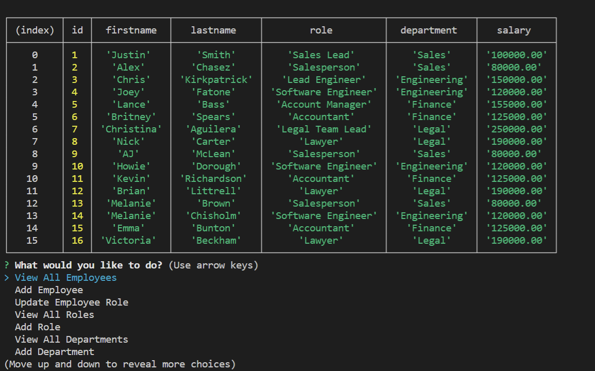
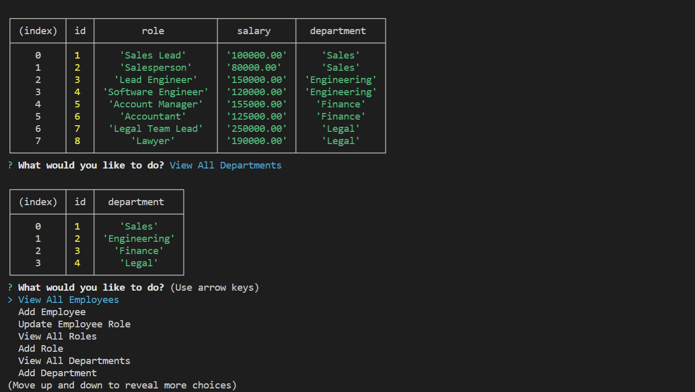

# Tracking Employees

There is still alot that I need to work on for this repository. I need to make the application have the functionality of adding a role and department. I also need to make it so that the user can update the role of an employee. Thankfully the overall functionality of the code works so it's just a matter of time before I go back and add the responsiveness. Below are some screenshots of what I currently have:

